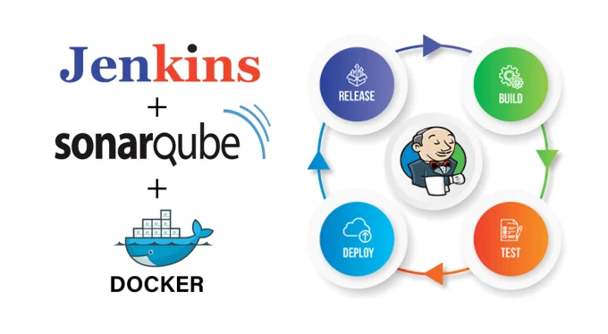

# Jenkins-Sonarqube-Docker Project Overview

## Overview

The project is a comprehensive implementation aimed at streamlining the software development lifecycle through automation, infrastructure as code, and continuous integration/continuous deployment (CI/CD) practices. It leverages various tools and technologies to achieve efficient code delivery, improved code quality, and enhanced deployment processes.

## Objectives:
- Automate the deployment process to reduce manual intervention and minimize deployment errors.
- Enhance code quality through automated code analysis and testing.
- Enable continuous integration and continuous deployment to achieve rapid and reliable software delivery.
- Provision infrastructure using Terraform to ensure consistency, scalability, and maintainability.

## Project Components

### Docker Containers for Website Deployment:
Docker containers offer a lightweight and consistent environment for deploying our website and associated services. By containerizing our applications, we ensure portability and isolation, enabling seamless deployment across different environments. Docker also facilitates easy scaling and updates, enhancing our ability to respond to changing demands efficiently.

### Jenkins for Continuous Integration and Continuous Deployment (CI/CD):
Jenkins is our primary CI/CD tool, responsible for automating various stages of the software delivery pipeline. Through Jenkins pipelines, we orchestrate tasks such as code compilation, testing, and deployment, enabling rapid iteration and feedback. Jenkins plugins extend its functionality, allowing integration with other tools and services to further enhance our CI/CD capabilities.

### SonarQube for Code Quality and Security Analysis:
SonarQube plays a crucial role in ensuring the quality and security of our codebase. By conducting static code analysis, SonarQube identifies code smells, bugs, and vulnerabilities early in the development process. This proactive approach to code review helps us maintain code quality standards, reduce technical debt, and mitigate security risks before they escalate.

## Terraform Infrastructure Setup

The Terraform configuration in this project automates the provisioning of infrastructure components required for our DevOps environment. Below is an overview of the Terraform modules used and their functionalities:

### VPC Module
The VPC (Virtual Private Cloud) module defines the networking environment for our infrastructure, including the VPC itself, subnets, route tables, and internet gateway. It ensures network isolation and provides the foundation for our EC2 instances.

### Security Groups Module
The Security Groups module configures security groups for our EC2 instances, controlling inbound and outbound traffic based on defined rules. These security groups enforce access policies and protect our infrastructure from unauthorized access.

### Jenkins EC2 Module
The Jenkins EC2 module provisions an EC2 instance for hosting the Jenkins CI/CD server. It specifies the instance type, AMI ID, key name, subnet ID, and user data script for automated setup. This instance serves as the central hub for our continuous integration and continuous deployment processes.

### SonarQube EC2 Module
The SonarQube EC2 module sets up an EC2 instance to host the SonarQube code quality and security analysis platform. Similar to the Jenkins module, it defines the instance configuration and user data script for automated installation and configuration.

### Docker EC2 Module
The Docker EC2 module provisions an EC2 instance for running Docker containers. It configures the instance parameters and user data script to install Docker and set up the Docker environment. This instance facilitates containerized deployments of our applications and services.

### Bash Scripts for Automated Server Setup:
Bash scripts play a pivotal role in automating the setup and configuration of our server instances. These scripts handle tasks such as package installation, service configuration, and environment setup, streamlining the deployment process. By automating routine tasks, we reduce manual errors, improve deployment speed, and enhance overall operational efficiency.

#### Usage
To deploy the infrastructure using Terraform, follow these steps:

1. Install Terraform on your local machine if not already installed.
2. Navigate to the root directory of the Terraform configuration files.
3. Update the `terraform.tfvars` file with your desired configurations, such as region, project name, CIDR blocks, etc.
4. Initialize Terraform with `terraform init`.
5. Review the planned changes with `terraform plan`.
6. Apply the changes with `terraform apply`.
7. Confirm the changes when prompted.

Ensure that you have appropriate AWS credentials configured to perform the Terraform actions.

